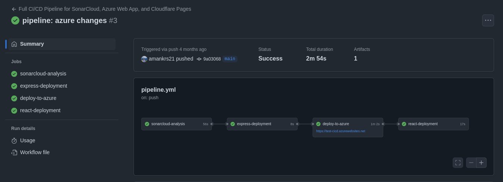

# 🌐 DevPps-Pipeline-Lab

A demo project showcasing CI/CD pipelines integrated with:

- ✅ **SonarCloud** for code quality analysis  
- 🚀 **Azure** for backend deployment  
- 🌩️ **Cloudflare Pages** for frontend hosting  

Includes a minimal **client-server** setup to validate the deployment process across platforms.

---

## 🧪 Tech Stack

- **CI/CD**: GitHub Actions
- **Frontend**: Simple HTML/CSS/JS or React (optional)
- **Backend**: Node.js / Python (or your stack)
- **Code Quality**: SonarCloud
- **Cloud Platforms**: Azure Web Apps, Cloudflare Pages

---

## ⚙️ Pipeline Features

- 🔍 Automated SonarCloud checks on PRs
- 📦 Build & deploy client to Cloudflare Pages
- 🔄 Deploy server/API to Azure Web App
- 💬 Notifications (optional) on status

---

## 🧰 Getting Started

1. **Clone the repo**
   ```bash
   git clone https://github.com/yourusername/cloudpipe-demo.git
   ```

2. **Configure secrets** in GitHub:
   - `AZURE_WEBAPP_NAME`
   - `AZURE_CREDENTIALS`
   - `CLOUDFLARE_API_TOKEN`
   - `SONAR_TOKEN`

3. **Push your changes** to trigger the pipelines!

---

## 📁 Repo Structure

```
cloudpipe-demo/
├── .github/workflows/      # CI/CD pipelines
├── client/                 # Frontend code (Cloudflare Pages)
├── server/                 # Backend code (Azure App Service)
├── README.md
└── ...
```

---

## 📸 Demo Workflow



---

## 📌 Tags

`cicd` `github-actions` `azure` `cloudflare-pages` `sonarcloud` `pipeline-demo` `devops` `cloud-deployment`

---

## 🧑‍💻 Author

Aman – DevOps Engineer & Cloud Enthusiast  
[LinkedIn](https://linkedin.com/in/amankrs21) | [GitHub](https://github.com/amankrs21)
